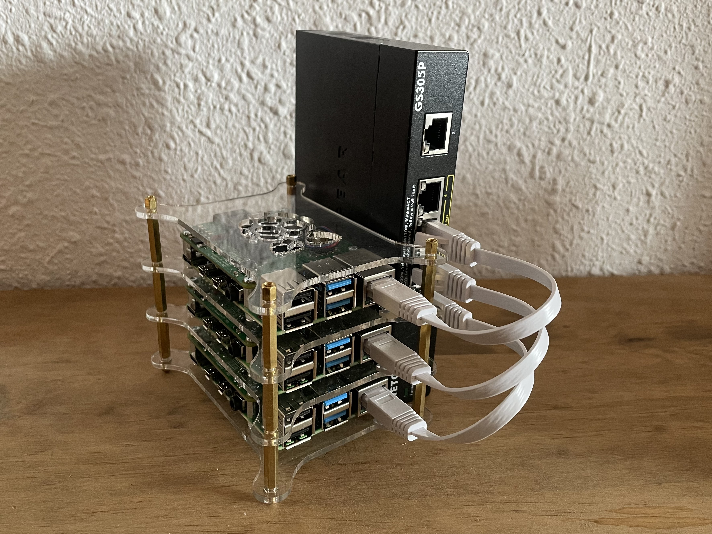

# Raspberry Pi Cluster

A K8s cluster of Raspberry Pis is used to learn more about K8s, experiment with GitOps, and self-host my projects.




## Table of Contents

<!-- TOC -->
* [Raspberry Pi Cluster](#raspberry-pi-cluster)
  * [Table of Contents](#table-of-contents)
  * [Tech Stack](#tech-stack)
  * [Usage](#usage)
    * [Raspberry Pi Configuration](#raspberry-pi-configuration)
    * [Development PC Configuration](#development-pc-configuration)
    * [Cluster Configuration](#cluster-configuration)
  * [Management & Maintenance](#management--maintenance)
    * [Cluster Management](#cluster-management)
    * [Cluster Maintenance](#cluster-maintenance)
  * [Miscellaneous](#miscellaneous)
    * [Parts List](#parts-list)
    * [Post Provisioning Diagram](#post-provisioning-diagram)
<!-- TOC -->

## Tech Stack

<table>
    <tr>
        <th>Logo</th>
        <th>Name</th>
        <th>Description</th>
    </tr>
    <tr>
        <td></td>
        <td><a href="https://www.ansible.com">Ansible</a></td>
        <td>Automate bare metal provisioning and configuration</td>
    </tr>
    <tr>
        <td></td>
        <td><a href="https://argoproj.github.io/cd">ArgoCD</a></td>
        <td>GitOps tool built to deploy applications to Kubernetes</td>
    </tr>
    <tr>
        <td></td>
        <td><a href="https://www.docker.com">Docker</a></td>
        <td>Containerization platform for software applications</td>
    </tr>
    <tr>
        <td></td>
        <td><a href="https://helm.sh">Helm</a></td>
        <td>The package manager for Kubernetes</td>
    </tr>
    <tr>
        <td></td>
        <td><a href="https://k3s.io">K3s</a></td>
        <td>Lightweight distribution of Kubernetes</td>
    </tr>
    <tr>
        <td></td>
        <td><a href="https://docs.konghq.com/gateway/">Kong Gateway</a></td>
        <td>API gateway for microservices architecture.</td>
    </tr>
    <tr>
        <td></td>
        <td><a href="https://docs.konghq.com/kubernetes-ingress-controller/">Kong KIC</a></td>
        <td>Kubernetes ingress controller for the Kong Gateway</td>
    </tr>
    <tr>
        <td></td>
        <td><a href="https://docs.konghq.com/konnect/">Kong Konnect</a></td>
        <td>API connectivity and management platform</td>
    </tr>
    <tr>
        <td></td>
        <td><a href="https://kubernetes.io">Kubernetes</a></td>
        <td>Container-orchestration system, the backbone of this project</td>
    </tr>
    <tr>
        <td></td>
        <td><a href="https://www.raspbian.org/">Raspbian</a></td>
        <td>Base OS for Kubernetes nodes</td>
    </tr>
    <tr>
        <td></td>
        <td><a href="https://www.whitesourcesoftware.com/free-developer-tools/renovate">Renovate</a></td>
        <td>Automatically update dependencies</td>
    </tr>
</table>

## Usage

To create the Pi Cluster follow the below steps in order to configure the Raspberry Pis, your development PC, and then the cluster.

### Raspberry Pi Configuration

Use the Raspberry Pi Imager to install Raspberry Pi OS (64 bit, lite) on each Pi's SD card.
Prior to installation, update the advanced configuration in the Imager, and set the following options:
- Set hostname: `node1.local` (set to `2` for node 2, `3` for node 3, etc.)
- Enable Remote SSH: 'Allow public-key', and paste in your public SSH key(s)

After all the Pis have had their OS installed:
- Turn on each pi
- Connect it to the same network as your Development PC

### Development PC Configuration
- Create a Kong Konnect Account at https://cloud.konghq.com/ 
- Install [Ansible](https://docs.ansible.com/ansible/latest/installation_guide/intro_installation.html)
- Clone this repo
- Update the [hosts.ini](https://github.com/baumac/baumac/blob/main/infra/pi-cluster/ansible/hosts.ini) file to set the correct hostnames for the `contral_plane` and `nodes`.
- Open a terminal and run `cd ./ansible && ansible all -m ping` to verify that ansible can ssh into each node

### Cluster Configuration 

After all prerequisites have been completed, use your Development PC to run the below command, which will install K3s, ArgoCd, Kong Ingress Controller, and the Kong Gateway.
```
ansible-playbook ./ansible/main.yml
```
Note: when prompted, make sure to add the required Konnect certificates as a secret in the cluster.

## Management & Maintenance

### Cluster Management
After the cluster has been provisioned, you can...
- Verify the cluster is reachable `curl -i node1.local:80`.
- Use `kubectl` to manage the cluster (e.g. view all pods with `kubectl get pods --all-namespaces`).

Note: The K3s' `kubeconfig` file is located at `/etc/rancher/k3s/k3s.yaml`. If you'd like to manage the cluster from other hosts (or using a tool like Lens), copy the contents of that file, replacing `localhost` with the IP address or hostname of the control plane node, and paste the contents into a file `~/.kube/config`.

### Cluster Maintenance

The following ansible tasks have been created to assist with day to day maintenance:
- Shutdown the cluster: `ansible-playbook ./ansible/tasks/util/shutdown.yml`
- Upgrade the cluster: `ansible-playbook ./ansible/tasks/util/upgrade.yml`
- Uninstall k3s from the cluster: `ansible-playbook ./ansible/tasks/util/uninstall.yml`

## Miscellaneous 

### Parts List

- 1 x Raspberry Pi Model 4b 4gb (master node)
- 2 x Raspberry Pi Model 4b 2gb (worker node)
- 3 x Samsung EV0+ 32GB microSD card
- 3 x Raspberry Pi Poe HAT
- 3 x Raspberry Pi Stackable Case
- 3 x 15cm Cat6 ethernet cables
- 55W 4xPoE+ 5-port Gigabit Network Switch

### Post Provisioning Diagram

TBD
